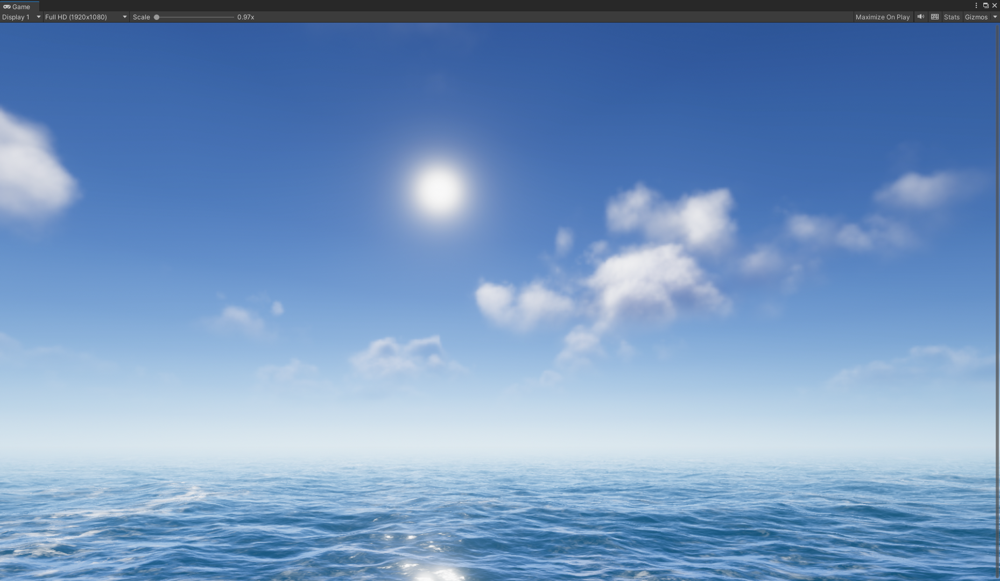

# URPSeaCloud

This is an sea&cloud integrated project for distance cloud rendering for URP (10.x+).  
The Demoscene1 can run up to 60FPS+ on the old graphics card HD 7730 (release time: June 25, 2013) at 1080p, and the cloud rendering cost time is about 2ms.   
Demoscene1's sea&cloud can also perform 30FPS on mobile devices(Android 1080p) which are using adreno 618 GPU.

Demo scene

Reference:  
https://www.guerrilla-games.com/read/the-real-time-volumetric-cloudscapes-of-horizon-zero-dawn
https://github.com/kode80/kode80CloudsUnity3D  
https://github.com/bearworks/URPOceanTessellation

Noise Tools:  
https://github.com/mtwoodard/TextureGenerator
